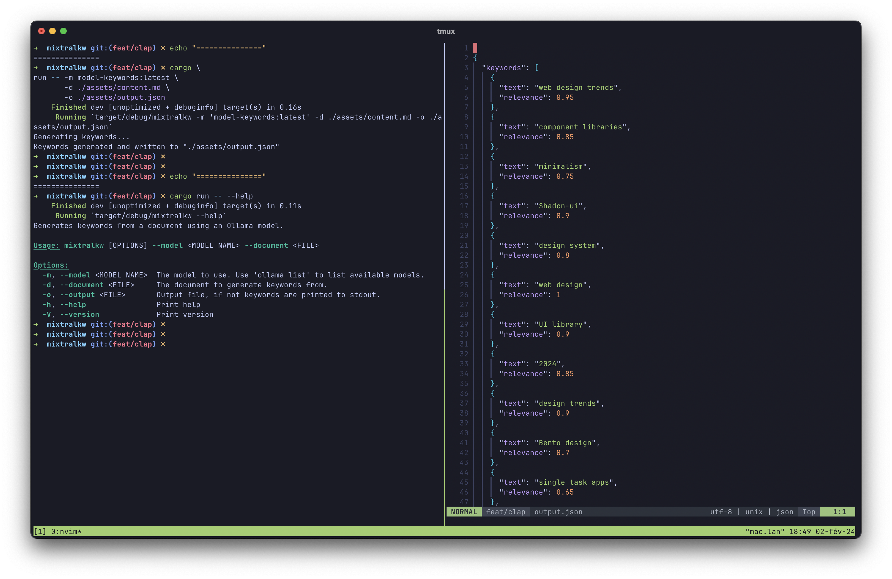

# mixtralkw



The simplest way to create your custom Mistral LLM. Let's build a keyword generator for your documents. It will be a simple Rust program that takes as input a text document and outputs a formatted list of keywords describing it.

## 🔗 Prerequisites

https://www.rust-lang.org/

https://ollama.ai/

## 🪄 Usage

Clone the project :

```bash
git clone git@github.com:PierreLouisLetoquart/mixtralkw.git
cd mixtralkw
```

Run the program with fake content :

```bash
cargo run -- -m model-keyword:latest -d ./assets/content.md
```

Storing the result in a file :

```bash
cargo run -- \
-m model-keyword:latest \
-d ./assets/content.md \
-o ./assets/keywords.json
```

To see available options :

```bash
cargo run -- --help
```

## 🔍 Explanations

### Create the model

The simplest way to "finetune" an LLM and use it locally is Ollama. We will create a [Modelfile](https://github.com/ollama/ollama/blob/main/docs/modelfile.md) and create our custom LLM with the `ollama create` command.

The `Modelfile` located in `./assets/` is a simple one and can be modified depending on your use case.

Then run the command to create the model:

```bash
ollama create <model-name> -f </path/to/Modelfile>
```

Great! To test the result, enter the command `ollama list` to see if the model has been created. You can also execute `ollama run <model-name>` and play with it in your command prompt.

> In the rust implementation, the main function will check if the model exists before running the program. If not, it will create it.

### Usage with Rust

This document is part of a Rust project, so the programmed logic is done in Rust. Feel free to implement your own logic in the language you like the most.

The pseudo algorithm for that use case is:

```bash
args = parse_args()

# args[0] is always the exec itself
model = args[1] # The name of the model created
path = args[2] # The document to extract keywords from

if !model_exists(model):
  cerate_model(model)

prompt = read_file_to_str(document_path)

res = ollama_exec(model, prompt)

if args[3].exists():
  write_to_file(args[3], res) # args[3] is the output file path (optional)
else:
  print(res)
```

Check `src/main.rs` for the Rust implementation; a bit bad but feel free to PR ;).

To run the program, replace the following command with your args:

```bash
cargo run -- -m MODEL -d DOC_PATH -o OUTPUT_PATH(optional)
```
